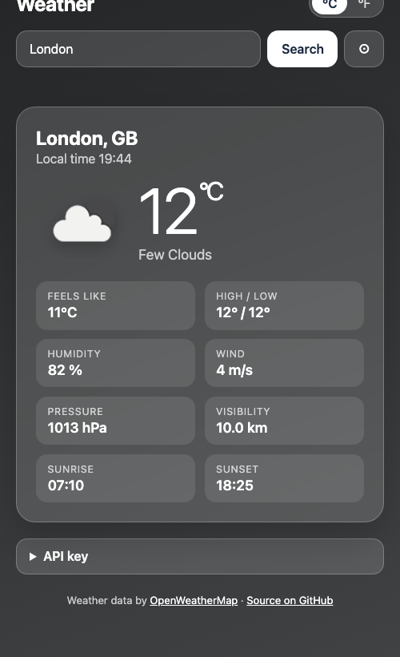
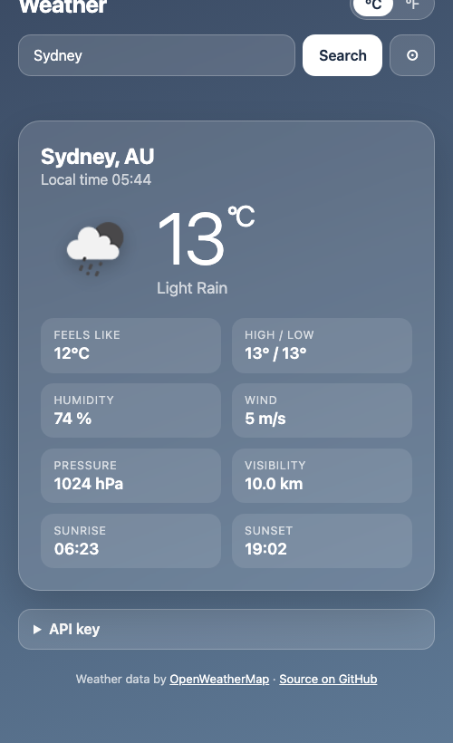
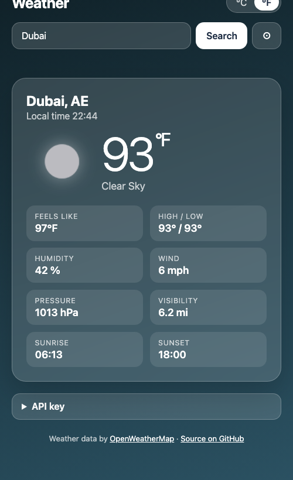
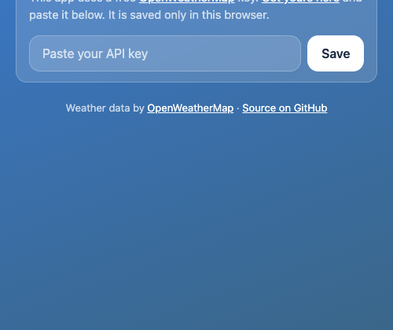

# Weather App

Search any city, or use your location, to see the current weather: temperature, conditions, feels-like, high and low, humidity, wind, pressure, visibility, sunrise and sunset. The background changes with the weather and the time of day, and you can switch between °C and °F.

Built with plain HTML, CSS and JavaScript. No build step, no dependencies.

**Live demo:** https://umar8092.github.io/weather-app/

## Screenshots

| London (clouds) | Sydney (rain) | Dubai (clear night, °F) |
|---|---|---|
|  |  |  |

The background changes with the weather and the time of day. On your first visit you will see the API key box:



*Screenshots show live data from OpenWeatherMap.*

## Get an API key (required)

The app gets its data from the **OpenWeatherMap** API, and you need your own free key:

1. Create a free account at [openweathermap.org](https://openweathermap.org/api) (the "Current Weather Data" API on the free plan is enough).
2. Open your [API keys page](https://home.openweathermap.org/api_keys) and copy the default key, or generate a new one.
3. New keys can take **up to 2 hours to activate**. Until then the app will say the key was rejected.

## Add the key

Pick one:

- **On the page:** open the **API key** box, paste your key and press Save. It is stored only in your own browser (local storage) and is never sent anywhere except to OpenWeatherMap.
- **In the code:** open `script.js` and replace `YOUR_API_KEY` with your key. Only do this for a copy you keep private.

> Never commit your real key to a public repo. Anyone can copy it and use up your quota.

## Run it locally

```
git clone https://github.com/umar8092/weather-app.git
```

Then open `index.html` in your browser.

## License

[MIT](LICENSE). Free to use, copy, modify and share. Made by [Muhammad Umar](https://github.com/umar8092).
